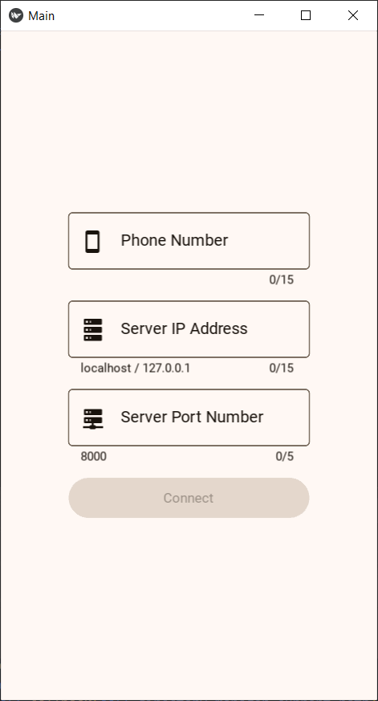
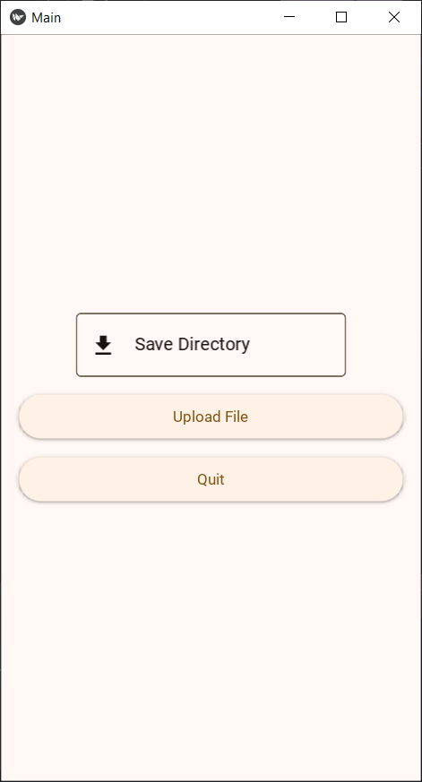

# SocketBlitz: Streamlined Socket Transfers with Kivy GUI

## Overview
SocketBlitz is a file transfer application designed to facilitate seamless data exchange over network sockets. With intuitive Graphical User Interface (GUI) built using Kivy, SocketBlitz offers a user-friendly experience for efficient and reliable transmission of files, regardless of size or complexity.

## Screenshots

## Key Features
- **Fast and Reliable:** SocketBlitz utilizes sockets for high-speed data transfer, ensuring fast and reliable transmission of files.
- **Cross-Platform:** Compatible with various operating systems including Windows, macOS, and Linux, SocketBlitz offers flexibility and convenience.
- **Intuitive GUI:** The Kivy-based GUI provides an intuitive interface, making it easy for users to initiate and manage file transfers.
- **No Size Limitations:** Whether transferring small documents or large multimedia files, SocketBlitz handles files of any size with ease.

## Installation
To install SocketBlitz, follow these steps:
1. Clone the repository: `git clone https://github.com/ShazwanX9/SocketBlitz.git`
2. Navigate to the project directory: `cd socketblitz`
3. Install dependencies: `pip install -r requirements.txt`
4. Run the server: `python app/server.py`
5. Run the application: `python ui/main.py`

## Usage
1. Launch the server by running `python app/server.py`.
2. Launch the application by running `python ui/main.py`.
3. In the application, select the option to connect to the server.
4. Enter the appropriate IP address and port number to establish a connection.
5. Once connected, the application will receive files from the server, except for the instance that initiated the connection.
6. If you want to send files to the server, ensure that another instance of the application is running and connected to the same server.
7. Choose the file(s) you want to send and send it.
8. Once the transfer is complete, the files will be available in the destination folder specified by the server.
9. To disconnect from the server, simply close the application or choose the appropriate option within the application's interface.

## Contributing
Contributions are welcome! If you have any suggestions, bug reports, or feature requests, please open an issue or submit a pull request on GitHub.

## License
SocketBlitz is licensed under the MIT License. See the [LICENSE](LICENSE) file for details.

## Acknowledgements
- SocketBlitz was inspired by the need for a simple yet efficient file transfer tool.
- We are grateful to the Kivy community for providing an excellent framework for building cross-platform GUI applications.
- For more information on the GUI [Kivy](https://kivy.org/), [KivyMD](https://github.com/kivymd/KivyMD)